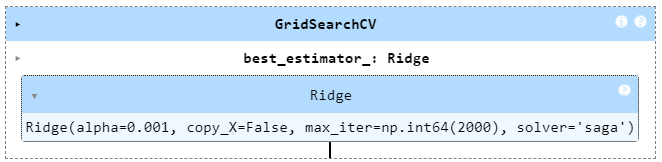

# <center><i>Prasunet Company Machine Learning Project - 01</i></center>

# <center>House Prices Prediction</center>

## Objective 🏠
The goal of this project is to develop a linear regression model to predict the prices of houses based on their square footage, number of bedrooms, and number of bathrooms. This predictive model can be used by real estate agents, potential buyers, and sellers to estimate the market value of a property.

---

## About the Dataset 📊

- Download the dataset from here: https://www.kaggle.com/c/house-prices-advanced-regression-techniques/data 

<center></center>

Ask a home buyer to describe their dream house, and they probably won't begin with the height of the basement ceiling or the proximity to an east-west railroad. But this playground competition's dataset proves that much more influences price negotiations than the number of bedrooms or a white-picket fence.

With 79 explanatory variables describing (almost) every aspect of residential homes in Ames, Iowa, this competition challenges you to predict the final price of each home.


## Key Variables 🏡

- `SalePrice` ->  The property's sale price in dollars. This is the target variable that you're trying to predict. 
- `MSSubClass` ->  The building class
- `MSZoning` ->  The general zoning classification
- `LotFrontage` ->  Linear feet of street connected to property
- `LotArea` ->  Lot size in square feet
- `Street` ->  Type of road access
- `Alley` ->  Type of alley access
- `LotShape` ->  General shape of property
- `LandContour` ->  Flatness of the property
- `Utilities` ->  Type of utilities available 
- `LotConfig` ->  Lot configuration
- `LandSlope` ->  Slope of property
- `Neighborhood` ->  Physical locations within Ames city limits
- `Condition1` ->  Proximity to main road or railroad
- `Condition2` ->  Proximity to main road or railroad (if a second is present)
- `BldgType` ->  Type of dwelling
- `HouseStyle` ->  Style of dwelling
- `OverallQual` ->  Overall material and finish quality
- `OverallCond` ->  Overall condition rating
- `YearBuilt` ->  Original construction date
- `YearRemodAdd` ->  Remodel date
- `RoofStyle` ->  Type of roof
- `RoofMatl` ->  Roof material
- `Exterior1st` ->  Exterior covering on house
- `Exterior2nd` ->  Exterior covering on house (if more than one material)
- `MasVnrType` ->  Masonry veneer type
- `MasVnrArea` ->  Masonry veneer area in square feet
- `ExterQual` ->  Exterior material quality
- `ExterCond` ->  Present condition of the material on the exterior
- `Foundation` ->  Type of foundation
- `BsmtQual` ->  Height of the basement
- `BsmtCond` ->  General condition of the basement
- `BsmtExposure` ->  Walkout or garden level basement walls
- `BsmtFinType1` ->  Quality of basement finished area
- `BsmtFinSF1` ->  Type 1 finished square feet
- `BsmtFinType2` ->  Quality of second finished area (if present)
- `BsmtFinSF2` ->  Type 2 finished square feet
- `BsmtUnfSF` ->  Unfinished square feet of basement area
- `TotalBsmtSF` ->  Total square feet of basement area
- `Heating` ->  Type of heating
- `HeatingQC` ->  Heating quality and condition
- `CentralAir` ->  Central air conditioning
- `Electrical` ->  Electrical system
- `1stFlrSF` ->  First Floor square feet
- `2ndFlrSF` ->  Second floor square feet
- `LowQualFinSF` ->  Low quality finished square feet (all floors)
- `GrLivArea` ->  Above grade (ground) living area square feet
- `BsmtFullBath` ->  Basement full bathrooms
- `BsmtHalfBath` ->  Basement half bathrooms
- `FullBath` ->  Full bathrooms above grade
- `HalfBath` ->  Half baths above grade
- `Bedroom` ->  Number of bedrooms above basement level
- `Kitchen` ->  Number of kitchens
- `KitchenQual` ->  Kitchen quality
- `TotRmsAbvGrd` ->  Total rooms above grade (does not include bathrooms)
- `Functional` ->  Home functionality rating
- `Fireplaces` ->  Number of fireplaces
- `FireplaceQu` ->  Fireplace quality
- `GarageType` ->  Garage location
- `GarageYrBlt` ->  Year garage was built
- `GarageFinish` ->  Interior finish of the garage
- `GarageCars` ->  Size of garage in car capacity
- `GarageArea` ->  Size of garage in square feet
- `GarageQual` ->  Garage quality
- `GarageCond` ->  Garage condition
- `PavedDrive` ->  Paved driveway
- `WoodDeckSF` ->  Wood deck area in square feet
- `OpenPorchSF` ->  Open porch area in square feet
- `EnclosedPorch` ->  Enclosed porch area in square feet
- `3SsnPorch` ->  Three season porch area in square feet
- `ScreenPorch` ->  Screen porch area in square feet
- `PoolArea` ->  Pool area in square feet
- `PoolQC` ->  Pool quality
- `Fence` ->  Fence quality
- `MiscFeature` ->  Miscellaneous feature not covered in other categories
- `MiscVal` ->  $Value of miscellaneous feature
- `MoSold` ->  Month Sold
- `YrSold` ->  Year Sold
- `SaleType` ->  Type of sale
- `SaleCondition` ->  Condition of sale


<br>

## Training Dataset 📊

As per the instructions given, the model to be trained should be a Linear Regression model, which is to be trained on square footage, number of bedrooms, and number of bathrooms.

### Features 🧩

- `1stFlrSF` ->  First Floor square feet
- `2ndFlrSF` ->  Second Floor square feet
- `LowQualFinSF` ->  Low quality finished square feet (all floors)
- `GrLivArea` ->  Above grade (ground) living area square feet
- `GarageArea` ->  Size of garage in square feet
- `WoodDeckSF` ->  Wood deck area in square feet
- `OpenPorchSF` ->  Open porch area in square feet
- `BsmtFullBath` ->  Basement full bathrooms
- `FullBath` ->  Full bathrooms above grade
- `HalfBath` ->  Half baths above grade
- `BedroomAbvGr` ->  Bedrooms above grade (does not include basement bedrooms)
- `TotRmsAbvGrd` ->  Total rooms above grade (does not include bathrooms)

<br>

## Models 🤖

<div style="text-align:center;">
    <div style="display:inline-block; margin: 20px;">
        <h3>Linear Regression Model</h3>
        
    </div>
    <div style="display:inline-block; margin: 20px;">
        <h3>Ridge Regression Model</h3>
        
    </div>
</div>


## Model Evaluation 🤖

### <center><i>Training Data Performance</i> 📈</center>
<center></center>


### <center><i>Test Data Performance</i> 📈</center>


<br>

## How to Set Up This Project

This guide walks you through setting up the project's environment.

**1. Install Python**

If you don't have Python installed yet, head over to the official download page: [https://wiki.python.org/moin/BeginnersGuide/Download](https://wiki.python.org/moin/BeginnersGuide/Download) and follow the instructions for your operating system (Windows, macOS, or Linux).

**2. Download the Repo**


1. Open your Git client or terminal.
2. Navigate to the directory where you want to clone the repository.
3. Run the following command, replacing `<repository_url>` with the actual URL of the project's repository:

```bash 
git clone <repository_url>
```

**3. Install required Dependencies**
1. Open terminal/cmd.
2. navigate to repo directory
3. Run the following command to install dependencies from requirements.txt:

``` bash
pip install -r requirements.txt
```

**4. Host the project Locally**

- After installing the required dependencies, run the following command to start the project locally:

``` bash
streamlit run server.py
```

